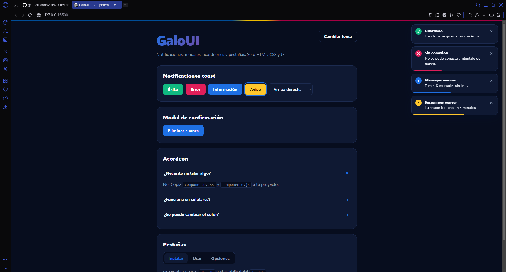
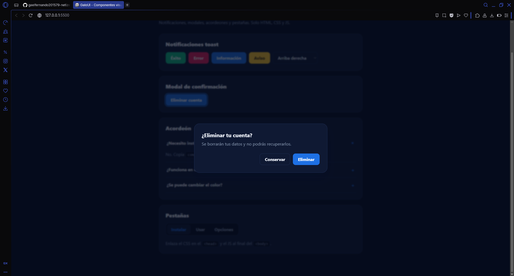
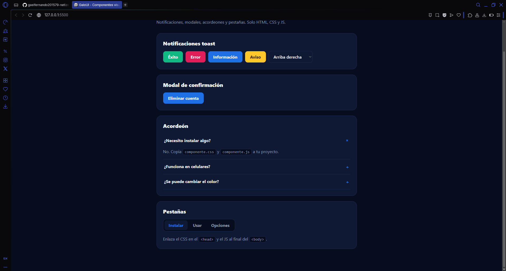
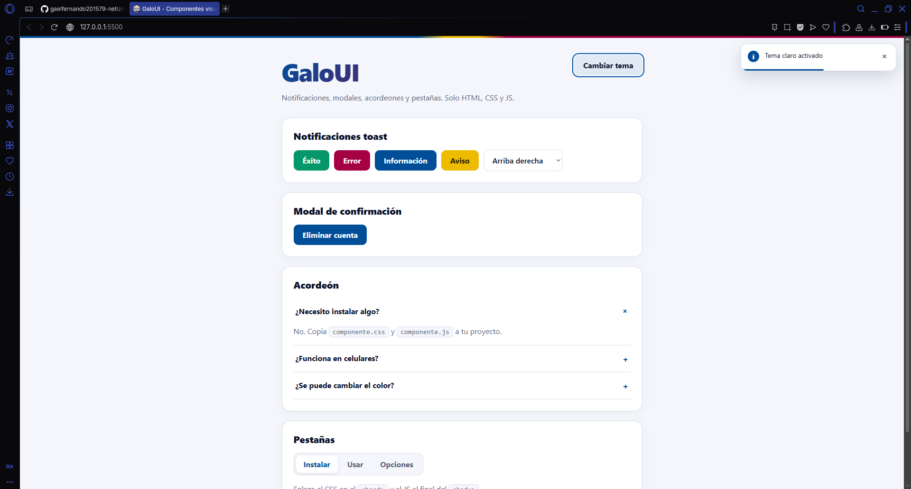

# GaloUI - Librería de Componentes Visuales Front-End

**Autor:** Ortíz Pérez Gael Fernando

**Problema que resuelve:** Simplifica la creación de elementos visuales e interactivos comunes en sitios web modernos (notificaciones, ventanas modales, acordeones, pestañas y modo oscuro) mediante HTML, CSS y JavaScript puros, eliminando la necesidad de importar frameworks pesados y/o complicados para tareas rutinarias como avisar al usuario, pedir una confirmación u organizar contenido.

## Descripción General

`GaloUI` es una librería de **JavaScript y CSS** que proporciona componentes reutilizables e interactivos: notificaciones tipo toast, modales de confirmación, acordeones, pestañas y cambio de tema claro/oscuro.

Está pensada para ser **ligera, portable y fácil de integrar** en cualquier proyecto: solo se necesitan dos archivos (`componente.css` y `componente.js`) y no tiene dependencias.

---

## Enlace en GitHub Pages

https://gaelfernando201579-netizen.github.io/componente-visual-js/

## Instalación

Para utilizar esta librería en cualquiera de tus proyectos, descarga los archivos `componente.css` y `componente.js`. Enlaza el CSS dentro de la etiqueta `<head>` y el JS antes del cierre de la etiqueta `<body>`:

```html
<head>
  <link rel="stylesheet" href="css/componente.css" />
</head>
<body>
  <!-- Tu contenido -->

  <script src="js/componente.js"></script>
</body>
```

## Capturas de Pantalla

**Notificaciones Toast**


**Modal de Confirmación**


**Acordeón y Pestañas**


**Modo Claro**


## Video Demostrativo

[](https://youtu.be/FS-nSNwpx78)

## Índice

- [Componentes Principales](#componentes-principales)
  1. [`Toast.show(opciones)`](#1-toastshowopciones)
  2. [`Toast.success(mensaje, opciones)`](#2-toastsuccessmensaje-opciones)
  3. [`Modal.open(opciones)`](#3-modalopenopciones)
  4. [`Modal.close()`](#4-modalclose)
  5. [Acordeón](#5-acordeón)
  6. [Pestañas](#6-pestañas)
- [Componentes Adicionales](#componentes-adicionales) 7. [`Theme`](#7-theme) 8. [Botones `.btn`](#8-botones-btn)

---

## Componentes Principales

### 1. `Toast.show(opciones)`

**Propósito:** Muestra una notificación emergente en una esquina de la pantalla. Se apila con las demás, se cierra sola al terminar su barra de progreso y también puede cerrarse con la `×`.

**Parámetros:** un objeto con las siguientes propiedades (todas opcionales).

| Nombre     | Tipo   | Por defecto   | Descripción                                                              |
| ---------- | ------ | ------------- | ------------------------------------------------------------------------ |
| `message`  | string | `''`          | Texto principal de la notificación.                                      |
| `title`    | string | `''`          | Título en negritas. Si está vacío, no se muestra.                        |
| `type`     | string | `'info'`      | Tipo y color: `'success'`, `'error'`, `'info'` o `'warning'`.            |
| `duration` | number | `4000`        | Milisegundos que permanece visible.                                      |
| `position` | string | `'top-right'` | Esquina: `'top-right'`, `'top-left'`, `'bottom-right'`, `'bottom-left'`. |

**Retorna:** `undefined` — solo muestra el toast en pantalla.

**Implementación:**

```javascript
class Toast {
  static show({
    message = "",
    title = "",
    type = "info",
    duration = 4000,
    position = "top-right",
  } = {}) {
    const contenedor = obtenerContenedor(position);

    const toast = document.createElement("div");
    toast.className = "toast toast-" + type;
    toast.innerHTML = `
      <span class="toast-icon"></span>
      <div class="toast-body">
        <strong class="toast-title"></strong>
        <span class="toast-message"></span>
      </div>
      <button class="toast-close" aria-label="Cerrar">&times;</button>
      <span class="toast-bar"></span>`;

    toast.querySelector(".toast-icon").textContent = ICONOS[type];
    toast.querySelector(".toast-title").textContent = title;
    toast.querySelector(".toast-message").textContent = message;

    const cerrar = () => {
      toast.classList.add("out");
      toast.addEventListener("animationend", () => {
        toast.remove();
        if (!contenedor.children.length) contenedor.remove();
      });
    };

    const barra = toast.querySelector(".toast-bar");
    barra.style.setProperty("--duracion", duration + "ms");
    barra.addEventListener("animationend", cerrar);
    toast.querySelector(".toast-close").addEventListener("click", cerrar);

    contenedor.appendChild(toast);
  }
}
```

**Cómo funciona:**

1. **Contenedor:** `obtenerContenedor(position)` busca el contenedor de esa esquina; si no existe, lo crea. Así los toasts de una misma esquina se apilan.
2. **Construcción:** se crea el HTML del toast dinámicamente con JavaScript.
3. **Seguridad:** los textos se asignan con `textContent`, por lo que si alguien escribe HTML en el mensaje, se muestra como texto y no se ejecuta.
4. **Temporizador:** la barra de progreso (`.toast-bar`) se anima con CSS durante `duration` milisegundos; cuando termina, dispara `cerrar`. Al pasar el mouse, el CSS **pausa** la barra y con ella el cierre.
5. **Cierre:** se agrega la clase `out` (animación de salida) y al terminar se elimina el elemento del DOM.

**Ejemplos:**

```javascript
Toast.show({ message: "Datos guardados", type: "success" });
Toast.show({
  title: "Error",
  message: "Sin conexión",
  type: "error",
  duration: 6000,
});
Toast.show({ message: "Nuevo mensaje", position: "bottom-left" });
Toast.show({ message: "<b>Hola</b>" }); // se muestra el texto literal, no se interpreta HTML
```

---

### 2. `Toast.success(mensaje, opciones)`

**Propósito:** Atajos para mostrar un toast de un tipo específico sin escribir el objeto completo. Existen cuatro: `Toast.success`, `Toast.error`, `Toast.info` y `Toast.warning`.

**Parámetros:**

| Nombre     | Tipo   | Descripción                                                                        |
| ---------- | ------ | ---------------------------------------------------------------------------------- |
| `mensaje`  | string | Texto de la notificación.                                                          |
| `opciones` | object | (Opcional) Cualquier otra opción de `Toast.show`: `title`, `duration`, `position`. |

**Retorna:** `undefined`.

**Implementación:**

```javascript
["success", "error", "info", "warning"].forEach((tipo) => {
  Toast[tipo] = (message, opciones = {}) =>
    Toast.show({ ...opciones, message, type: tipo });
});
```

**Cómo funciona:**

Recorre los cuatro tipos y, para cada uno, crea una función que llama a `Toast.show` con el mensaje y el tipo ya definidos. Las opciones adicionales se combinan con el operador `...`.

**Ejemplos:**

```javascript
Toast.success("Guardado");
Toast.error("No se pudo conectar");
Toast.warning("Tu sesión termina pronto", { duration: 8000 });
Toast.info("Tema oscuro activado", { position: "bottom-right" });
```

---

### 3. `Modal.open(opciones)`

**Propósito:** Abre una ventana modal de confirmación sobre un fondo oscuro. Se puede cerrar con la tecla `Escape`, haciendo clic fuera de la ventana o con el botón de cancelar. Solo puede haber un modal abierto a la vez.

**Parámetros:** un objeto con las siguientes propiedades (todas opcionales).

| Nombre        | Tipo     | Por defecto  | Descripción                                        |
| ------------- | -------- | ------------ | -------------------------------------------------- |
| `title`       | string   | `''`         | Título del modal.                                  |
| `content`     | string   | `''`         | Texto descriptivo.                                 |
| `confirmText` | string   | `'Aceptar'`  | Texto del botón de confirmar.                      |
| `cancelText`  | string   | `'Cancelar'` | Texto del botón de cancelar.                       |
| `onConfirm`   | function | —            | Función que se ejecuta cuando el usuario confirma. |

**Retorna:** `undefined`.

**Implementación:**

```javascript
class Modal {
  static open({
    title = "",
    content = "",
    confirmText = "Aceptar",
    cancelText = "Cancelar",
    onConfirm,
  } = {}) {
    Modal.close();

    const fondo = document.createElement("div");
    fondo.className = "modal-overlay";
    fondo.innerHTML = `
      <div class="modal" role="dialog" aria-modal="true">
        <h3 class="modal-title"></h3>
        <p class="modal-text"></p>
        <div class="modal-actions">
          <button class="btn btn-ghost" data-accion="cancelar"></button>
          <button class="btn btn-primary" data-accion="confirmar"></button>
        </div>
      </div>`;
    // ...los textos se asignan con textContent...

    fondo.addEventListener("click", (e) => {
      const accion = e.target.dataset.accion;
      if (e.target === fondo || accion === "cancelar") Modal.close();
      if (accion === "confirmar") {
        Modal.close();
        if (onConfirm) onConfirm();
      }
    });

    Modal.alTeclear = (e) => {
      if (e.key === "Escape") Modal.close();
    };
    document.addEventListener("keydown", Modal.alTeclear);

    document.body.appendChild(fondo);
    Modal.actual = fondo;
    requestAnimationFrame(() => fondo.classList.add("open"));
  }
}
```

**Cómo funciona:**

1. **Un solo modal:** primero llama a `Modal.close()` para cerrar cualquier modal anterior.
2. **Construcción:** genera el fondo (`.modal-overlay`) y la ventana con JavaScript, y asigna los textos con `textContent`.
3. **Eventos:** un único `click` en el fondo distingue qué se presionó gracias al atributo `data-accion`. Clic fuera de la ventana o en cancelar → cierra. Confirmar → cierra y ejecuta `onConfirm`.
4. **Teclado:** escucha la tecla `Escape` para cerrar.
5. **Animación:** la clase `open` se agrega un instante después de insertar el elemento (`requestAnimationFrame`) para que se vea la animación de entrada.

**Ejemplos:**

```javascript
Modal.open({
  title: "¿Eliminar tu cuenta?",
  content: "Se borrarán tus datos y no podrás recuperarlos.",
  confirmText: "Eliminar",
  cancelText: "Conservar",
  onConfirm: () => Toast.success("Cuenta eliminada"),
});

Modal.open({ title: "Aviso", content: "Cambios guardados." }); // botones por defecto
```

---

### 4. `Modal.close()`

**Propósito:** Cierra el modal que esté abierto, con animación de salida.

**Parámetros:** ninguno.

**Retorna:** `undefined`. Si no hay modal abierto, no hace nada.

**Implementación:**

```javascript
static close() {
  if (!Modal.actual) return;
  const fondo = Modal.actual;
  Modal.actual = null;
  document.removeEventListener('keydown', Modal.alTeclear);
  fondo.classList.remove('open');
  setTimeout(() => fondo.remove(), 300);
}
```

**Cómo funciona:**

1. Si no hay modal abierto, termina.
2. Quita el oyente de la tecla `Escape` para no acumular eventos.
3. Quita la clase `open` (inicia la animación de salida) y elimina el elemento del DOM 300 ms después, cuando la animación ya terminó.

**Ejemplo:**

```javascript
Modal.open({ title: "Procesando..." });
setTimeout(() => Modal.close(), 2000); // se cierra solo a los 2 segundos
```

---

### 5. Acordeón

**Propósito:** Muestra una lista de preguntas o secciones que se despliegan con animación al hacer clic. **No requiere escribir JavaScript**: basta con usar las clases correctas en el HTML.

**Clases y atributos:**

| Nombre        | Dónde va             | Descripción                                                                   |
| ------------- | -------------------- | ----------------------------------------------------------------------------- |
| `.acc-item`   | Cada sección         | Contenedor de una cabecera y su panel. Con la clase `open` inicia desplegada. |
| `.acc-head`   | `<button>`           | Cabecera en la que se hace clic.                                              |
| `.acc-panel`  | Panel                | Contenido que se despliega (lleva un `<div>` interno).                        |
| `data-single` | Contenedor del grupo | (Opcional) Solo permite un panel abierto a la vez.                            |

**Retorna:** no aplica (es HTML + CSS + un oyente global).

**Implementación:**

```html
<div data-single>
  <div class="acc-item open">
    <button class="acc-head" aria-expanded="true">
      ¿Necesito instalar algo?
    </button>
    <div class="acc-panel">
      <div><p>No, solo copia los archivos.</p></div>
    </div>
  </div>
  <div class="acc-item">
    <button class="acc-head" aria-expanded="false">
      ¿Funciona en celulares?
    </button>
    <div class="acc-panel">
      <div><p>Sí, es adaptable.</p></div>
    </div>
  </div>
</div>
```

```javascript
function alternarAcordeon(cabecera) {
  const item = cabecera.parentElement;
  const acordeon = item.parentElement;

  if (acordeon.hasAttribute("data-single")) {
    acordeon.querySelectorAll(".acc-item.open").forEach((otro) => {
      if (otro !== item) {
        otro.classList.remove("open");
        otro.querySelector(".acc-head").setAttribute("aria-expanded", "false");
      }
    });
  }
  const abierto = item.classList.toggle("open");
  cabecera.setAttribute("aria-expanded", abierto);
}
```

**Cómo funciona:**

1. Un solo `click` global detecta si se presionó un `.acc-head` y llama a `alternarAcordeon`.
2. Si el grupo tiene `data-single`, primero cierra las demás secciones abiertas.
3. `classList.toggle('open')` abre o cierra la sección y devuelve si quedó abierta, para actualizar `aria-expanded` (accesibilidad).
4. **Animación en CSS:** el panel es un `grid` cuya fila pasa de `0fr` a `1fr`, lo que anima la altura sin calcularla en JavaScript.

**Ejemplo:** el bloque HTML de la sección anterior funciona tal cual; quita `data-single` si quieres que varios paneles puedan estar abiertos al mismo tiempo.

---

### 6. Pestañas

**Propósito:** Organiza contenido en pestañas: al presionar un botón se muestra su panel y se oculta el anterior, sin recargar la página. **No requiere escribir JavaScript**.

**Clases y atributos:**

| Nombre       | Dónde va   | Descripción                                                            |
| ------------ | ---------- | ---------------------------------------------------------------------- |
| `.tabs`      | Contenedor | Agrupa los botones y los paneles.                                      |
| `.tabs-nav`  | Barra      | Contiene los botones.                                                  |
| `.tab-btn`   | `<button>` | Botón de pestaña. Su atributo `data-tab` debe ser el `id` de su panel. |
| `.tab-panel` | Panel      | Contenido de la pestaña. Con la clase `active` está visible.           |

**Retorna:** no aplica (es HTML + CSS + un oyente global).

**Implementación:**

```html
<div class="tabs">
  <div class="tabs-nav">
    <button class="tab-btn active" data-tab="instalar">Instalar</button>
    <button class="tab-btn" data-tab="usar">Usar</button>
  </div>
  <div class="tab-panel active" id="instalar">Contenido de instalar.</div>
  <div class="tab-panel" id="usar">Contenido de usar.</div>
</div>
```

```javascript
function cambiarPestana(boton) {
  const pestanas = boton.closest(".tabs");
  pestanas
    .querySelectorAll(".tab-btn")
    .forEach((b) => b.classList.toggle("active", b === boton));
  pestanas
    .querySelectorAll(".tab-panel")
    .forEach((p) => p.classList.toggle("active", p.id === boton.dataset.tab));
}
```

**Cómo funciona:**

1. Un solo `click` global detecta si se presionó un `.tab-btn` y llama a `cambiarPestana`.
2. Busca el contenedor `.tabs` más cercano, así puede haber varios grupos de pestañas en la misma página sin que se mezclen.
3. Marca como `active` solo el botón presionado y solo el panel cuyo `id` coincide con el `data-tab` del botón.

**Ejemplo:** para agregar una pestaña nueva, añade un `.tab-btn` con `data-tab="nueva"` y un `.tab-panel` con `id="nueva"`.

---

## Componentes Adicionales

### 7. `Theme`

**Propósito:** Cambia entre tema **claro** y **oscuro**. Recuerda la elección del usuario y, si no hay ninguna guardada, respeta el tema de su sistema operativo.

**Métodos:**

| Método              | Descripción                                                           | Retorna                   |
| ------------------- | --------------------------------------------------------------------- | ------------------------- |
| `Theme.set(nombre)` | Aplica el tema `'light'` o `'dark'` y lo guarda en `localStorage`.    | `undefined`               |
| `Theme.toggle()`    | Alterna entre claro y oscuro.                                         | `string` — el tema nuevo. |
| `Theme.init()`      | Aplica el tema guardado o el del sistema. Se ejecuta automáticamente. | `undefined`               |

**Implementación:**

```javascript
const Theme = {
  set(nombre) {
    document.documentElement.dataset.theme = nombre;
    try {
      localStorage.setItem("theme", nombre);
    } catch (e) {}
  },
  toggle() {
    const nuevo =
      document.documentElement.dataset.theme === "dark" ? "light" : "dark";
    this.set(nuevo);
    return nuevo;
  },
  init() {
    let guardado = null;
    try {
      guardado = localStorage.getItem("theme");
    } catch (e) {}
    const sistemaOscuro = matchMedia("(prefers-color-scheme: dark)").matches;
    this.set(guardado || (sistemaOscuro ? "dark" : "light"));
  },
};
Theme.init();
```

**Cómo funciona:**

1. `set` escribe el atributo `data-theme` en la etiqueta `<html>`. El CSS define los colores oscuros en `[data-theme="dark"]`, por lo que todos los componentes cambian a la vez.
2. Los colores de toda la librería son **variables CSS** (`--bg`, `--surface`, `--ink`, `--accent`, ...), lo que también permite personalizarla editando solo el inicio del CSS.
3. `try/catch` evita errores si el navegador bloquea `localStorage`.

**Ejemplos:**

```javascript
Theme.toggle(); // "dark" o "light"
Theme.set("dark");

const tema = Theme.toggle();
Toast.info("Tema " + tema + " activado", { duration: 2000 });
```

---

### 8. Botones `.btn`

**Propósito:** Clases CSS para botones con el mismo estilo que usan los componentes de la librería.

**Clases:**

| Clase          | Descripción                                    |
| -------------- | ---------------------------------------------- |
| `.btn`         | Clase base (obligatoria en todos los botones). |
| `.btn-primary` | Color de acento principal.                     |
| `.btn-ghost`   | Botón transparente con borde.                  |
| `.btn-success` | Verde.                                         |
| `.btn-error`   | Rojo.                                          |
| `.btn-info`    | Azul.                                          |
| `.btn-warning` | Amarillo.                                      |

**Retorna:** no aplica (solo CSS).

**Implementación:**

```css
.btn {
  font: inherit;
  font-weight: 700;
  padding: 10px 18px;
  border: 1px solid transparent;
  border-radius: 10px;
  cursor: pointer;
}
.btn:active {
  transform: scale(0.96);
}
.btn-primary {
  background: var(--accent);
  color: var(--on-accent);
}
```

**Cómo funciona:**

`.btn` define la forma y el efecto al presionar; cada clase de color solo cambia el fondo y el texto usando las variables de color, por eso se adaptan solas al tema oscuro.

**Ejemplos:**

```html
<button class="btn btn-primary">Guardar</button>
<button class="btn btn-ghost">Cancelar</button>
<button class="btn btn-success" onclick="Toast.success('Listo')">Probar</button>
```
